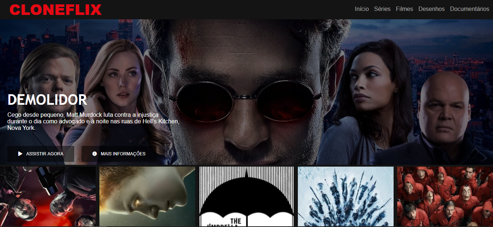

# **Recriação da página principal do Netflix**

## Projeto do Bootcamp JavaScript Game Developer na plataforma Digital Innovation One

### Ministrado por: [Felipe Aguiar](https://github.com/felipeAguiarCode)  

### **Objetivo**  

Recriar a interface do principal site de streaming mundial utilizando as linguagens HTML5, CSS3 e JavaScript.

### **Conceitos Abordados**
- Estruturação de layout.
- Técnicas de CSS3 com containers e variáveis.
- Posicionamento dos elementos com Flexbox.  
- Utilização de plugins Jquery a favor da sua aplicação.
- Criação de página responsiva com Media Queries.

### **Tecnologias Utilizadas**
- Visual Studio Code
    - Live Server
- Navegador

### **Resultado Final**

